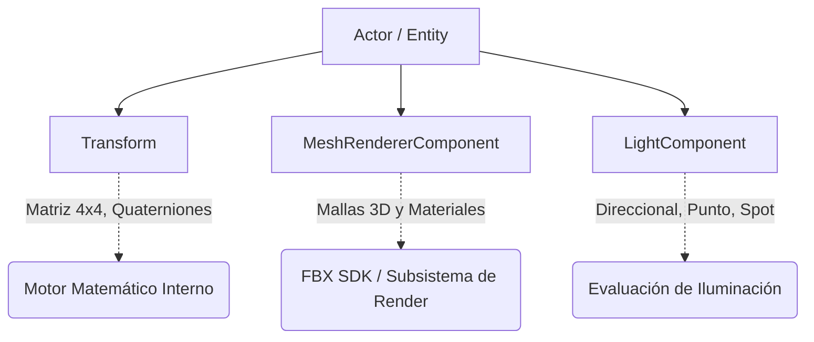
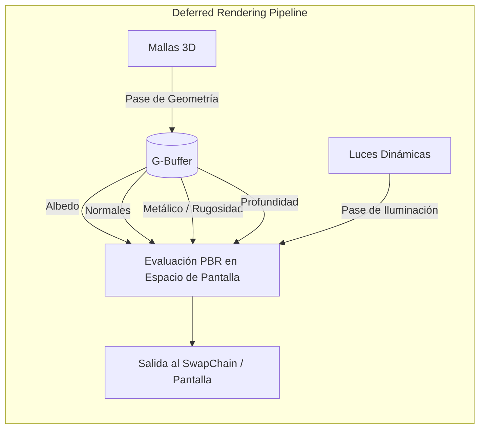

# WildvineEngine

**WildvineEngine** es un motor gráfico 3D de alto rendimiento desarrollado en C++ y basado en la API de DirectX 11. El proyecto emplea una arquitectura moderna de Entity Component System (ECS) y está diseñado para soportar técnicas de renderizado avanzadas como Forward y Deferred Rendering, además de contar con soporte para materiales PBR y renderizado de sombras.

---

## 🧠 Arquitectura del Motor

### Entity Component System (ECS)
La estructura central utiliza un patrón de diseño **ECS** para garantizar flexibilidad y modularidad. En lugar de utilizar una jerarquía de herencia profunda, cada objeto en la escena es un `Actor` (Entidad) que obtiene su comportamiento y propiedades al ensamblar diferentes componentes.



### Pipelines de Renderizado
El motor abstrae la API de **DirectX 11** para ofrecer diferentes rutas de renderizado, permitiendo optimizar escenas según su complejidad lumínica y geométrica:

#### Forward Rendering con Shadow Mapping
La rama actual implementa un renderizador Forward que calcula la iluminación y el color final de cada píxel mientras se dibuja la geometría. Este pipeline incluye un pase previo de profundidad para generar mapas de sombras realistas y precisos.

#### Deferred Rendering
Optimizado para manejar una cantidad masiva de luces dinámicas en tiempo real al separar la evaluación geométrica de la iluminación.



---

## 🚀 Características y Subsistemas

* **Materiales PBR e Iluminación:** Implementación de *Physically Based Rendering*. Los objetos (`MaterialInstance`) reaccionan de manera físicamente precisa mediante mapas de *Albedo*, *Normal*, *Roughness* y *Metallic*.
* **Entornos Inmersivos:** Soporte nativo para **Skyboxes**, implementando cubemaps proyectados con manipulación directa de los estados matemáticos de *Depth-Stencil*.
* **Interfaz y Herramientas (Editor):** Integración con el *branch* de Docking de **Dear ImGui** (`EditorViewportPass`), permitiendo ventanas acoplables, manipulación de vistas de escena y depuración en tiempo real.
* **Gestión de Geometría:** Importación y procesamiento de mallas y esqueletos 3D a nivel industrial utilizando el **Autodesk FBX SDK**.
* **Librería Core y Matemática Personalizada:** Para garantizar el máximo rendimiento, el motor cuenta con implementaciones propias de álgebra lineal (`Matrix4x4`, `Quaternion`, `Vector3`), gestión de memoria (`TUniquePtr`, `TSharedPointer`) y contenedores de datos (`TArray`, `TMap`).

---

## 📂 Estructura del Repositorio

| Directorio | Descripción |
| :--- | :--- |
| `include/` | Cabeceras (`.h`) organizadas por subsistemas (ECS, Renderizado, SceneGraph). |
| `source/` | Código fuente (`.cpp`) del núcleo del motor. |
| `lib/fbxlibs/` | Librerías estáticas precompiladas necesarias (FBX SDK, zlib, libxml2). |
| `docs/` | Archivos de configuración de **Doxygen** para la API y flujos de GitHub Actions. |
| `Imgui/` | Código fuente y backends de renderizado para Dear ImGui. |

---

## 🛠️ Requisitos del Sistema

* **Sistema Operativo:** Windows 10 / 11.
* **IDE:** Visual Studio (2019/2022) o entorno compatible con MSVC.
* **GPU:** Tarjeta gráfica de alto rendimiento compatible con DirectX 11 (ej. NVIDIA RTX 4070 o equivalente).
* **Procesador:** Hardware multinúcleo recomendado (ej. Intel i9-13900K o equivalente) para la compilación y procesamiento del Scene Graph.
* **Lenguaje:** C++17 o superior.

---

## ⚙️ Configuración y Compilación

1.  Clona el repositorio desde la rama principal de renderizado de sombras:
    ```bash
    git clone -b ForwardRendering+shadows1 https://github.com/TheStixd23/wildvineengine.git
    ```
2.  Abre la solución `WildvineEngine_2010.sln` (o superior) en Visual Studio.
3.  Verifica las rutas de inclusión en tu Linker asegurándote de apuntar a `lib/fbxlibs/`.
4.  Selecciona la arquitectura de compilación **x64** y ejecuta el *build*.


