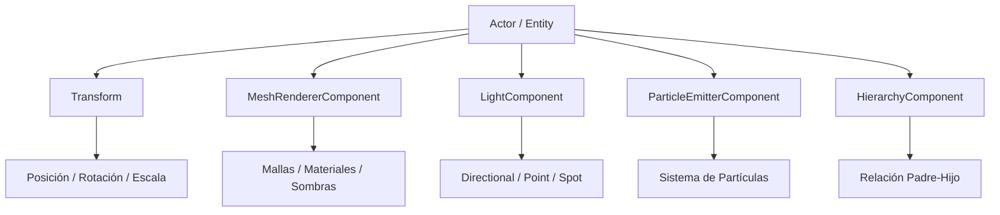
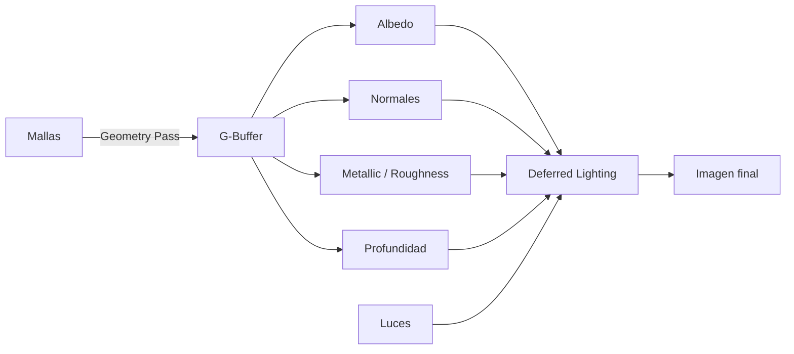
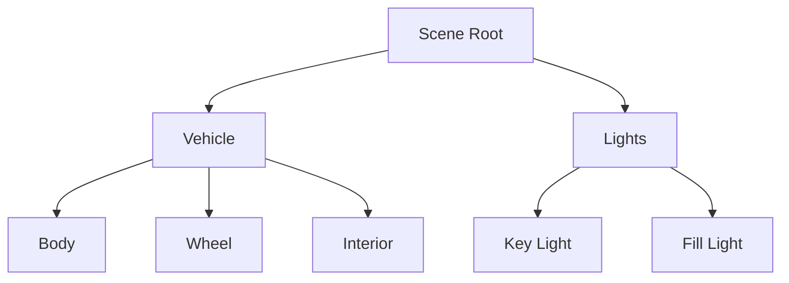
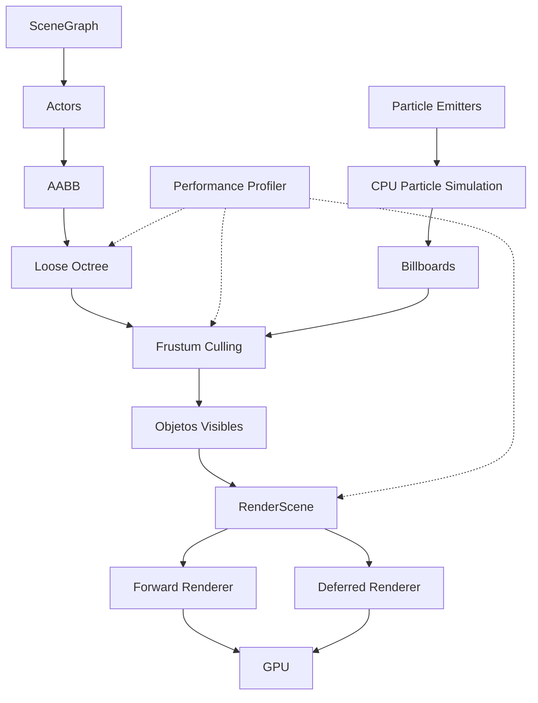

# 🌿 WildvineEngine

**WildvineEngine** es un motor gráfico y editor 3D desarrollado en **C++** utilizando **DirectX 11**.

El proyecto utiliza una arquitectura basada en **Entity Component System (ECS)** y cuenta con herramientas propias para renderizado, importación de modelos, materiales PBR, iluminación, administración de escenas, optimización espacial, profiling y sistemas de partículas.

El objetivo principal del proyecto es desarrollar un motor modular que permita comprender e implementar desde cero diferentes procesos utilizados dentro de un motor gráfico moderno.

---

## ✨ Estado actual

| Sistema                           | Estado |
| :-------------------------------- | :----: |
| Editor 3D                         |    ✅   |
| Forward Rendering                 |    ✅   |
| Deferred Rendering                |    ✅   |
| Materiales PBR                    |    ✅   |
| Importación FBX                   |    ✅   |
| Importación OBJ / MTL             |    ✅   |
| Directional Light                 |    ✅   |
| Point Light                       |    ✅   |
| Spotlight                         |    ✅   |
| Shadow Mapping                    |    ✅   |
| Scene Graph                       |    ✅   |
| Jerarquía padre-hijo              |    ✅   |
| Guardado y carga de escenas       |    ✅   |
| Frustum Culling                   |    ✅   |
| Loose Octree                      |    ✅   |
| Performance Profiler              |    ✅   |
| Debug visual de Culling           |    ✅   |
| Sistema de partículas CPU         |    ✅   |

---

# 🧠 Arquitectura del motor

## Entity Component System — ECS

WildvineEngine utiliza una arquitectura basada en **Entity Component System**.

Cada elemento dentro de la escena se representa mediante un `Actor`. Su comportamiento depende de los componentes que tenga asociados.



Esta estructura permite agregar nuevas funcionalidades sin depender de grandes jerarquías de herencia.

---

# 🖥️ Editor 3D

WildvineEngine incluye un editor construido utilizando **Dear ImGui** e **ImGuizmo**.

Entre las herramientas disponibles se encuentran:

* Viewport 3D en tiempo real.
* Jerarquía de actores.
* Inspector de propiedades.
* Navegador de recursos.
* Consola.
* Performance Profiler.
* Gizmos de transformación.
* Selección mediante clic.
* Drag & Drop de modelos.
* Creación de luces.
* Creación de sistemas de partículas.
* Herramientas de debug.
* Guardado y carga de escenas.

El viewport es el área principal de trabajo y las herramientas visuales permanecen recortadas dentro de él para evitar que gizmos, AABB o indicadores atraviesen la interfaz.

---

# 🎮 Controles principales

| Acción            |       Control      |
| :---------------- | :----------------: |
| Mover objeto      |         `W`        |
| Rotar objeto      |         `E`        |
| Escalar objeto    |         `R`        |
| Enfocar selección |         `F`        |
| Eliminar          |       `Supr`       |
| Duplicar          |     `Ctrl + D`     |
| Copiar            |     `Ctrl + C`     |
| Pegar             |     `Ctrl + V`     |
| Deshacer          |     `Ctrl + Z`     |
| Rehacer           |     `Ctrl + Y`     |
| Guardar escena    |     `Ctrl + S`     |
| Guardar como      | `Ctrl + Shift + S` |

---

# 🎨 Pipelines de renderizado

WildvineEngine implementa dos rutas principales de renderizado.

## Forward Rendering

El pipeline Forward calcula materiales e iluminación durante el renderizado de cada objeto.

Se utiliza principalmente para:

* Geometría tradicional.
* Materiales transparentes.
* Partículas.
* Shadow Mapping.
* Elementos auxiliares del editor.

---

## Deferred Rendering

El pipeline Deferred divide el proceso en diferentes etapas.

Primero se almacena la información geométrica en un **G-Buffer** y posteriormente se realiza la evaluación de iluminación.



Esta separación permite trabajar de forma más eficiente con diferentes fuentes de iluminación.

---

# 🎨 Materiales PBR

El motor utiliza materiales basados en **Physically Based Rendering**.

Los materiales pueden utilizar los siguientes canales:

| Canal               | Función                 |
| :------------------ | :---------------------- |
| Albedo / Base Color | Color principal         |
| Normal              | Detalle superficial     |
| Metallic            | Comportamiento metálico |
| Roughness           | Rugosidad               |
| Ambient Occlusion   | Oclusión ambiental      |
| Emissive            | Emisión                 |
| Opacity             | Transparencia           |

Cada submalla puede mantener su propio `materialSlot`.

Esto permite que un mismo modelo utilice diferentes materiales para carrocería, cristales, llantas, metal, interiores, etc.

---

# 📦 Importación de modelos

El motor soporta actualmente:

```text
FBX
OBJ
MTL
```

---

## Importación FBX

La carga se realiza utilizando **Autodesk FBX SDK**.

El importador procesa información como:

* Posiciones de vértices.
* Índices.
* Normales.
* Tangentes.
* Bitangentes.
* Coordenadas UV.
* Submallas.
* Material Slots.
* Transformaciones.
* Rotaciones previas y posteriores.
* Pivotes.
* Escala.
* Jerarquía de nodos.
* Unidades del archivo.

Una de las mejoras principales fue evitar modificaciones específicas para modelos individuales.

Actualmente el importador intenta respetar la estructura y transformación con la que el recurso fue exportado.

---

## Importación OBJ

El parser OBJ admite:

```text
v
vt
vn
f
usemtl
mtllib
```

También permite:

* Leer archivos `.mtl`.
* Triangular polígonos.
* Conservar materiales.
* Procesar normales y coordenadas UV.

---

# 🖼️ Carga automática de texturas

WildvineEngine busca automáticamente las texturas asociadas a los materiales.

Se comprueban diferentes ubicaciones, por ejemplo:

```text
Assets/
Assets/Textures/
Assets/Materials/
Assets/Particles/
Carpeta del modelo
Carpetas .fbm
```

El motor reconoce nombres comunes como:

```text
BaseColor
Albedo
Diffuse
Normal
Metallic
Metalness
Roughness
AO
Occlusion
Emissive
```

Si una textura no puede cargarse, se utilizan recursos **fallback** para evitar que el modelo se vuelva invisible o completamente negro.

---

# 💡 Sistema de iluminación

Actualmente existen tres tipos principales de luz:

### Directional Light

Representa una fuente de iluminación a gran distancia.

### Point Light

Emite iluminación alrededor de una posición.

### Spotlight

Permite trabajar con:

* Posición.
* Dirección.
* Intensidad.
* Rango.
* Color.
* Ángulo interior.
* Ángulo exterior.

El editor también incluye representaciones visuales para facilitar su configuración.

---

# 💡 Rig de iluminación

Se agregó una configuración automática de tres puntos compuesta por:

```text
Key Light
Fill Light
Rim Light
```

El rig puede orientarse alrededor del objeto seleccionado para crear una iluminación de presentación.

---

# 🌑 Shadow Mapping

WildvineEngine implementa un pase de profundidad para generar sombras.

El sistema utiliza:

* Shadow Map.
* Matriz de vista de la luz.
* Matriz de proyección.
* `Cast Shadows`.
* `Receive Shadows`.

Las sombras cúbicas para Point Lights todavía se consideran una mejora futura.

---

# 🌳 Scene Graph

Los actores de la escena pueden organizarse mediante relaciones padre-hijo.

Ejemplo:



El sistema permite:

* Cambiar el padre de un Actor.
* Regresarlo a la raíz.
* Mantener transformaciones.
* Mover hijos junto al padre.
* Evitar ciclos.
* Duplicar actores.
* Restaurar eliminaciones mediante Undo.

---

# 💾 Sistema de escenas

Las escenas utilizan el formato propio:

```text
.wvscene
```

Se puede almacenar:

* Actores.
* Nombre.
* Modelo asociado.
* Transformación.
* Jerarquía.
* Materiales.
* Luces.
* Cámara.
* Visibilidad.
* Selección.

También se implementó:

* Nueva escena.
* Abrir.
* Guardar.
* Guardar como.
* Autoguardado.
* Recuperación.
* Copia `.bak`.

---

# 👁️ Frustum Culling

Una de las principales herramientas de optimización implementadas fue **Frustum Culling**.

El Frustum representa el volumen que puede observar la cámara y se genera mediante:

```text
View Matrix
+
Projection Matrix
```

Está compuesto por seis planos:

```text
Left
Right
Top
Bottom
Near
Far
```

Antes de enviar un Actor al renderer se compara su AABB con este volumen.

---

## Clasificación

### 🟢 Inside

El objeto se encuentra completamente dentro.

```text
→ Render
```

### 🟠 Intersect

Parte del objeto está dentro y parte fuera.

```text
→ Render
```

### 🔴 Outside

El objeto está completamente fuera.

```text
→ Cull
```

El objeto no se envía al renderer.

---

# 📦 AABB

Para realizar las pruebas se utiliza una **Axis-Aligned Bounding Box**.

En lugar de comprobar todos los triángulos de un modelo:

```text
Miles de triángulos
```

solo se compara:

```text
AABB
↓
Frustum
```

reduciendo considerablemente el costo de la prueba.

---

# 🐙 Loose Octree

Como complemento del Frustum Culling se implementó un **Loose Octree**.

El objetivo es organizar espacialmente los objetos para evitar realizar una prueba individual para cada uno.

El espacio se divide en ocho regiones:

```text
X → 2
Y → 2
Z → 2

2 × 2 × 2 = 8
```

Cada nodo puede volver a subdividirse.

---

## ¿Por qué Loose Octree?

Un Octree estricto puede tener problemas con objetos grandes o colocados justo sobre el límite de diferentes regiones.

Para evitarlo, los nodos utilizan una pequeña holgura:

```text
Loose Factor
```

Por ejemplo:

```text
1.35
```

De esta forma los objetos pueden introducirse correctamente dentro de regiones sin duplicarlos.

---

# 🔎 Octree + Frustum

El flujo pasa de:

```text
Frustum
↓
Objeto 1
Objeto 2
Objeto 3
Objeto 4
...
```

a:

```text
Octree
↓
Región
↓
Frustum
```

Si una región completa está fuera:

```text
Region Outside
↓
Descartar contenido completo
```

Esto permite evitar muchas pruebas AABB individuales.

---

# ⚙️ Configuración del Octree

El editor permite modificar:

* Profundidad máxima.
* Cantidad máxima de objetos por nodo.
* Loose Factor.
* Presets de configuración.

Los presets principales son:

```text
Ligero
Equilibrado
Denso
```

La configuración equilibrada es adecuada para la mayoría de las pruebas.

---

# ✅ Validación Octree vs Frustum

Se agregó un sistema de validación que ejecuta:

```text
Frustum directo
```

y:

```text
Frustum + Octree
```

sobre los mismos actores.

Posteriormente compara los resultados.

El resultado esperado es:

```text
0 diferencias
```

Esto permite demostrar que el Octree solamente cambia **cómo se encuentran los objetos visibles**, pero no modifica incorrectamente qué debería renderizarse.

---

# 📊 Performance Profiler

Se desarrolló un Profiler integrado en el editor para medir el comportamiento del motor.

Entre las métricas disponibles se encuentran:

* FPS.
* Frame Time.
* Frame Time mínimo.
* Frame Time promedio.
* Frame Time máximo.
* Draw Calls.
* Objetos totales.
* Objetos visibles.
* Objetos descartados.
* Triángulos.
* Tiempo de Culling.
* Tiempo de construcción del Octree.
* Tiempo de consulta.
* Nodos probados.
* Nodos descartados.
* Pruebas AABB.
* Pruebas evitadas.

---

## Ejemplo

```text
Objetos:                    200
Visibles:                    52
Descartados:                148

Pruebas posibles:           200
Pruebas individuales:        47
Pruebas evitadas:           153
```

Esto permite demostrar con datos el funcionamiento de la optimización.

---

# 🐞 Debug visual

El editor incluye herramientas de visualización para estudiar el funcionamiento del Culling.

### AABB

```text
Verde    → Inside
Naranja  → Intersect
Rojo     → Outside
```

### Octree

```text
Cian → nodo dentro
Azul → nodo intersectando
Rojo → nodo descartado
```

También puede visualizarse el volumen completo del Frustum.

---

# ❄️ Frustum congelado

Existe un modo especial para congelar la representación del Frustum.

Esto permite:

1. Congelar la vista.
2. Mover la cámara.
3. Observar el volumen desde fuera.

La versión mejorada incluye:

* Plano `NEAR`.
* Plano `FAR`.
* Caras semitransparentes.
* Bordes destacados.
* Esquinas.
* Eje central.
* Indicador de la cámara congelada.

Esto facilita la comprensión visual del sistema.

> El Frustum congelado es únicamente de debug. El Culling real continúa utilizando la cámara actual.

---

# ✨ Sistema de partículas

WildvineEngine también incluye un sistema de partículas simulado mediante CPU.

Cada partícula almacena propiedades como:

```text
Posición
Velocidad
Edad
Lifetime
Tamaño
Rotación
Color
Estado
```

---

## Particle Pooling

Para evitar crear y destruir objetos constantemente se implementó un **pool de partículas**.

Las partículas se crean previamente.

Cuando una muere:

```text
Active
↓
Inactive
↓
Disponible para reutilizar
```

Esto evita asignaciones dinámicas constantes.

---

# 🖼️ Billboarding

Cada partícula utiliza un quad.

El quad se orienta continuamente hacia la cámara mediante:

```text
Camera Right
Camera Up
```

Esta técnica se conoce como:

**Billboarding**

y permite utilizar sprites 2D dentro de una escena 3D.

---

# 🔥 Presets de partículas

Actualmente existen presets para:

### 🔥 Fuego

* Additive blending.
* Movimiento vertical.
* Vida corta.
* Emissive.

### 💨 Humo

* Alpha blending.
* Movimiento lento.
* Expansión progresiva.
* Alpha gradual.

### ✨ Chispas

* Velocidad alta.
* Lifetime corto.
* Gravedad.
* Additive blending.

### 🌫️ Polvo

* Movimiento suave.
* Dispersión.
* Transparencia.

También existe un modo personalizado.

---

# 🎛️ Inspector de partículas

Desde el editor puede modificarse:

* Spawn Rate.
* Máximo de partículas.
* Lifetime.
* Loop.
* Burst.
* Dirección.
* Velocidad.
* Spread.
* Gravity.
* Radio.
* Start Size.
* End Size.
* Color.
* Alpha.
* Alpha Cutoff.
* Emissive.
* Blend Mode.
* Textura.

También existen controles:

```text
Play
Pause
Stop
Restart
Burst
```

---

# 📊 Partículas en el Profiler

El sistema se conectó con el Performance Profiler.

Ahora es posible medir:

```text
Emisores activos
Partículas activas
Máximo de partículas
Spawn por frame
CPU Simulation Time
Billboard Build Time
```

---

# 👁️ Culling de partículas

Los emisores generan una AABB dinámica.

En lugar de comprobar cada partícula contra el Frustum:

```text
Particle Emitter
↓
Dynamic AABB
↓
Frustum
```

Si el sistema completo queda fuera de cámara, puede evitarse su renderizado.

---

# 📐 Rejilla 3D con Depth Test

Originalmente la rejilla del editor era dibujada como un overlay mediante ImGuizmo.

Por ese motivo las líneas parecían atravesar modelos.

Se reemplazó por geometría 3D real.

Ahora participa en el mismo:

```text
Depth Buffer
```

que el resto de objetos.

Por lo tanto, si un modelo está delante:

```text
Modelo
↓
oculta correctamente la rejilla
```

---

# 🛡️ Estabilidad

También se agregaron distintas validaciones para mejorar la estabilidad del motor:

* Comprobación de archivos.
* Validación de AABB.
* Validación de índices.
* Protección contra `NaN`.
* Protección contra valores infinitos.
* Protección contra división entre cero.
* Prevención de ciclos en el Scene Graph.
* Fallback de texturas.
* Liberación de recursos FBX.
* Protección contra conflictos `min/max` de Windows.
* Recuperación ante recursos faltantes.

Una regla utilizada en los sistemas de Culling es:

> Si no es posible asegurar que un objeto está fuera de cámara, se mantiene visible.

Esto evita desapariciones accidentales.

---

# 📂 Estructura principal

```text
WildvineEngine/
│
├── include/
│   ├── ECS/
│   ├── Rendering/
│   ├── SceneGraph/
│   ├── EngineUtilities/
│   └── fbx/
│
├── source/
│   ├── ECS/
│   ├── Rendering/
│   ├── SceneGraph/
│   └── GUI/
│
├── bin/
│   └── Assets/
│       ├── Models/
│       ├── Textures/
│       └── Particles/
│
├── Imgui/
├── lib/
└── docs/
```

---

# 🛠️ Requisitos

* Windows 10 / 11.
* Visual Studio 2019 o superior.
* MSVC.
* C++17 o superior.
* DirectX 11.
* GPU compatible con DirectX 11.
* Autodesk FBX SDK.
* Dear ImGui.
* ImGuizmo.

No es obligatorio utilizar una GPU de gama específica. Para escenas complejas se recomienda una GPU dedicada.

---

# ⚙️ Compilación

## 1. Clonar el repositorio

```bash
git clone -b ForwardRendering+shadows1 https://github.com/TheStixd23/wildvineengine.git
```

## 2. Abrir Visual Studio

Abre la solución `.sln` correspondiente al proyecto.

## 3. Seleccionar arquitectura

```text
x64
```

## 4. Verificar dependencias

Comprueba que las rutas del:

```text
FBX SDK
DirectX
ImGui
```

estén configuradas correctamente.

## 5. Compilar

```text
Compilar
→ Limpiar solución

Compilar
→ Recompilar solución
```


---

# 🚀 Flujo actual del motor

El flujo general puede representarse de la siguiente forma:



---

# 📝 Principales mejoras realizadas

* Rediseño del editor.
* Importación FBX mejorada.
* Importación OBJ / MTL.
* Materiales por submalla.
* Búsqueda automática de texturas.
* Directional, Point y Spot Lights.
* Rig de iluminación.
* Jerarquía padre-hijo.
* Guardado y carga de escenas.
* Undo / Redo.
* Frustum Culling.
* AABB dinámicas.
* Debug visual del Frustum.
* Frustum congelado.
* Loose Octree.
* Debug del Octree.
* Validación Octree vs Frustum.
* Performance Profiler.
* Sistema de partículas CPU.
* Particle Pooling.
* Billboarding.
* Alpha y Additive Blending.
* Presets de partículas.
* Culling de emisores.
* Rejilla 3D con Depth Test.
* Mejoras generales de estabilidad.

---

# 🎯 Objetivo del proyecto

WildvineEngine busca funcionar como plataforma de aprendizaje para comprender cómo se construyen internamente diferentes sistemas de un motor gráfico.

Las herramientas implementadas permiten estudiar temas como:

```text
Rendering
ECS
Scene Graph
PBR
Iluminación
Importación de recursos
Particionado espacial
Culling
Profiling
Partículas
Depth Testing
```

El desarrollo se ha enfocado no únicamente en hacer que cada funcionalidad opere, sino también en proporcionar herramientas visuales y estadísticas que permitan **entender, comprobar y explicar técnicamente cómo funciona cada sistema**.

---

# 👨‍💻 Tecnologías principales


**WildvineEngine — Custom 3D Engine & Editor developed with C++ and DirectX 11.**
