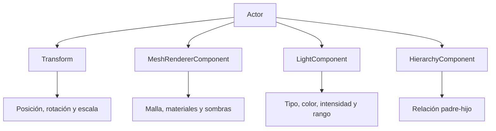
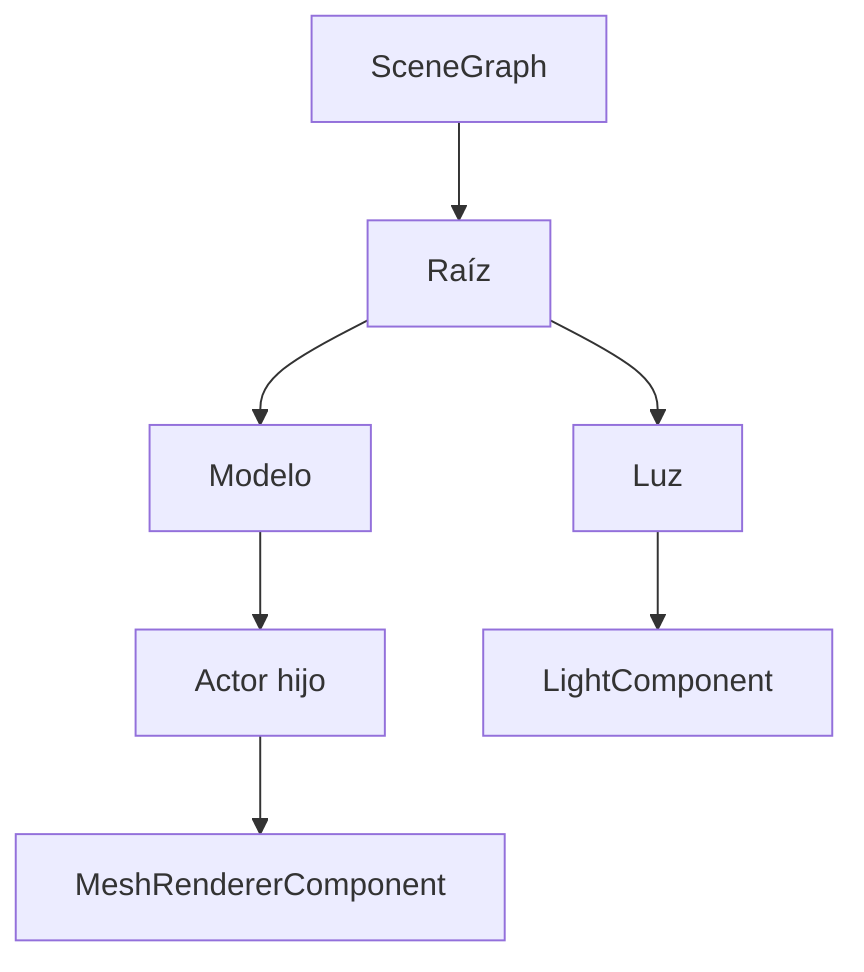
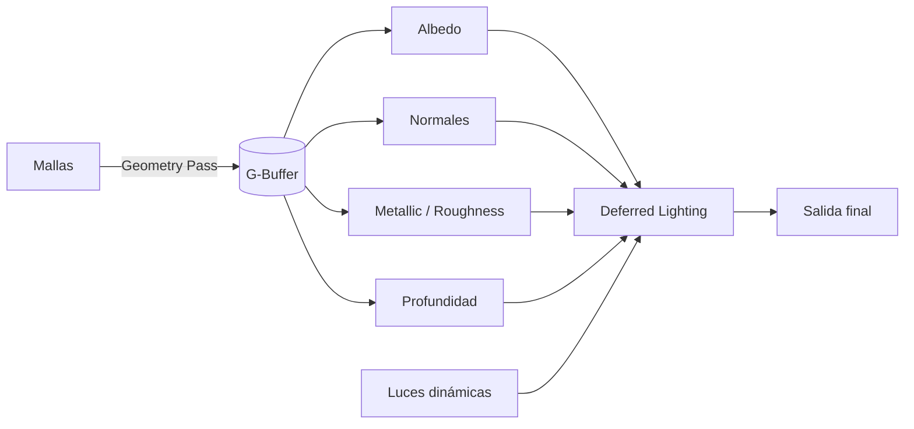

# 🌿 WildvineEngine

**WildvineEngine** es un motor gráfico 3D desarrollado en **C++** sobre **DirectX 11**. Incluye un editor propio construido con **Dear ImGui**, una arquitectura basada en **Entity Component System (ECS)**, renderizado Forward y Deferred, materiales PBR, importación de modelos FBX/OBJ, luces dinámicas y herramientas para crear y administrar escenas.

> El objetivo del proyecto es ofrecer un entorno de edición 3D donde sea posible importar recursos, colocarlos directamente en la escena, modificar sus propiedades, configurar iluminación y guardar el trabajo para continuar después.

---

## ✨ Estado actual

El proyecto cuenta con un editor funcional que permite trabajar con modelos, luces, materiales y escenas desde una misma interfaz.

| Sistema | Estado |
| :--- | :---: |
| Editor 3D | ✅ |
| Importación FBX | ✅ |
| Importación OBJ/MTL | ✅ |
| Materiales PBR | ✅ |
| Directional Light | ✅ |
| Point Light | ✅ |
| Spotlight | ✅ |
| Jerarquía padre-hijo | ✅ |
| Undo / Redo | ✅ |
| Guardado de escenas | ✅ |
| Autoguardado | ✅ |
| Animación esquelética | 🚧 |
| Sombras para Point Lights | 🚧 |

---

## 🖥️ Editor 3D

La interfaz del editor está organizada para mantener el viewport como área principal de trabajo.

### Paneles disponibles

- **Jerarquía:** muestra todos los actores presentes en la escena.
- **Viewport:** permite visualizar, seleccionar y transformar objetos.
- **Inspector:** muestra las propiedades del elemento seleccionado.
- **Recursos:** contiene los modelos y texturas disponibles.
- **Consola:** presenta mensajes, advertencias y errores.
- **Rendimiento:** muestra FPS, draw calls y resolución del viewport.

Las herramientas visuales del editor, como la cuadrícula, los gizmos, las cajas de selección y los conos de luz, permanecen recortadas dentro del viewport para evitar que se dibujen sobre otros paneles.

---

## 🎮 Controles principales

| Acción | Control |
| :--- | :---: |
| Mover objeto | `W` |
| Rotar objeto | `E` |
| Escalar objeto | `R` |
| Enfocar selección | `F` |
| Eliminar objeto | `Supr` |
| Duplicar | `Ctrl + D` |
| Copiar | `Ctrl + C` |
| Pegar | `Ctrl + V` |
| Deshacer | `Ctrl + Z` |
| Rehacer | `Ctrl + Y` |
| Guardar escena | `Ctrl + S` |
| Guardar como | `Ctrl + Shift + S` |

---

## 📦 Importación de modelos

Los modelos pueden arrastrarse desde el navegador de recursos y soltarse directamente dentro del viewport.

Cuando se importa un objeto:

1. Se carga su geometría.
2. Se procesan sus materiales.
3. Se buscan sus texturas.
4. Se calcula su posición dentro de la escena.
5. Se crea un actor.
6. El objeto queda seleccionado automáticamente.
7. El gizmo aparece sobre él.

### Formatos soportados

- `.fbx`
- `.obj`
- `.mtl`

---

## 🔷 Importación FBX

La importación utiliza **Autodesk FBX SDK**.

El flujo de carga procesa:

- Posiciones de vértices.
- Índices.
- Normales.
- Tangentes y bitangentes.
- Coordenadas UV.
- Submallas.
- Slots de materiales.
- Transformaciones de nodos.
- Rotaciones previas y posteriores.
- Pivotes.
- Escala.
- Unidades.
- Jerarquía interna.
- Pose estática inicial de deformadores compatibles.

El importador está pensado para respetar la estructura con la que el modelo fue exportado, evitando ajustes específicos para un recurso en particular.

> Actualmente los modelos animados se importan en una pose estática. La reproducción de animaciones esqueléticas todavía no forma parte del flujo principal.

---

## 🔶 Importación OBJ

El cargador OBJ incluye soporte para:

- Posiciones mediante `v`.
- Coordenadas UV mediante `vt`.
- Normales mediante `vn`.
- Caras mediante `f`.
- Materiales mediante `usemtl`.
- Bibliotecas de materiales mediante `mtllib`.
- Triangulación de polígonos.
- Lectura de archivos `.mtl`.

---

## 🎨 Materiales y texturas

Cada submalla conserva su slot de material. Esto permite que un solo modelo utilice materiales independientes para distintas partes.

Ejemplos:

- Carrocería.
- Cristales.
- Llantas.
- Interiores.
- Metal.
- Plástico.
- Luces.

### Canales PBR

Los materiales pueden utilizar:

| Canal | Uso |
| :--- | :--- |
| Albedo / Base Color | Color principal |
| Normal | Relieve superficial |
| Metallic | Nivel metálico |
| Roughness | Rugosidad |
| Ambient Occlusion | Oclusión ambiental |
| Emissive | Emisión de luz |
| Opacity | Transparencia |

### Búsqueda automática de texturas

El motor busca texturas en diferentes ubicaciones:

1. Ruta registrada dentro del FBX.
2. Carpeta donde se encuentra el modelo.
3. Carpeta `.fbm` generada por el exportador.
4. Subcarpetas `Textures`, `textures` o `Materials`.
5. `Assets/Textures/<NombreDelModelo>`.
6. `Assets/Textures` como respaldo.

También reconoce nombres comunes como:

```text
BaseColor
Albedo
Diffuse
Normal
Metallic
Metalness
Roughness
AO
Occlusion
Emissive
```

Cuando una textura no se encuentra, el motor utiliza materiales fallback para evitar objetos completamente negros, invisibles o inválidos.

---

## 🧱 Arquitectura ECS

La estructura principal utiliza el patrón **Entity Component System**.

Cada objeto de la escena se representa mediante un `Actor`, al cual se le agregan componentes según su función.



### Componentes principales

| Componente | Responsabilidad |
| :--- | :--- |
| `Transform` | Posición, rotación, escala y matrices |
| `MeshRendererComponent` | Malla, materiales, visibilidad y sombras |
| `LightComponent` | Datos y comportamiento de luces |
| `HierarchyComponent` | Relación entre padres e hijos |

---

## 🌳 Jerarquía de escena

El SceneGraph permite organizar actores mediante relaciones padre-hijo.

Desde el panel de jerarquía es posible:

- Crear actores.
- Seleccionar objetos.
- Convertir un actor en hijo de otro.
- Regresar un actor a la raíz.
- Mantener su posición visual al cambiar de padre.
- Mover hijos junto con su padre.
- Evitar relaciones circulares.
- Duplicar modelos, luces y actores vacíos.
- Restaurar elementos eliminados con Undo.



---

## 💡 Iluminación

El motor cuenta con soporte desde C++ para tres tipos de luz:

- **Directional Light**
- **Point Light**
- **Spotlight**

Cada luz puede configurar:

- Estado activo.
- Color.
- Intensidad.
- Rango.
- Dirección.
- Ángulo interior.
- Ángulo exterior.
- Proyección de sombras.

El editor también muestra indicadores visuales para las luces y conos de dirección para los spotlights.

### Rig de iluminación

Se puede crear un rig automático de tres luces:

- **Key Light**
- **Fill Light**
- **Rim Light**

Estas luces pueden colocarse alrededor del objeto seleccionado y orientarse hacia su centro.

> El resultado visual final de los spotlights depende de que el shader activo procese el tipo de luz y sus ángulos.

---

## 🖼️ Pipelines de renderizado

WildvineEngine incluye rutas de renderizado Forward y Deferred.

### Forward Rendering

La iluminación se calcula mientras se dibuja la geometría. Esta ruta es adecuada para escenas con una cantidad controlada de luces y permite utilizar shadow mapping.

### Deferred Rendering

El pipeline Deferred separa el procesamiento de la geometría y la iluminación mediante un G-Buffer.



El renderer valida los valores enviados por las luces y utiliza un límite seguro de elementos activos.

---

## 🌑 Sombras

El sistema de sombras incluye:

- Pase de profundidad.
- Shadow map.
- Matrices de vista y proyección de luz.
- Propiedad `Cast Shadows`.
- Propiedad `Receive Shadows`.
- Priorización de luces con sombras.

Las Point Lights todavía no generan sombras cúbicas, ya que esto requiere un cubemap de profundidad y seis pases de renderizado.

---

## 💾 Guardado de escenas

Las escenas utilizan el formato:

```text
.wvscene
```

Una escena conserva:

- Actores.
- Nombres.
- Rutas de modelos.
- Posición, rotación y escala.
- Jerarquía.
- Visibilidad.
- Materiales.
- Luces.
- Cámara.
- Objeto seleccionado.

### Funciones disponibles

- Nueva escena.
- Abrir escena.
- Guardar.
- Guardar como.
- Autoguardado.
- Recuperación de autoguardado.
- Copia de seguridad `.bak`.
- Validación antes de reemplazar una escena.

Si un modelo ya no existe en su ruta original, el editor puede mantener un actor vacío con su nombre y transformación para evitar perder la estructura de la escena.

---

## 🧰 Herramientas del editor

### Navegador de recursos

- Búsqueda por nombre.
- Filtro de modelos y texturas.
- Miniaturas ajustables.
- Orden alfabético.
- Drag and drop.
- Importación mediante doble clic.

### Inspector

El inspector cambia según el elemento seleccionado.

#### Modelos

- Transformación.
- Visibilidad.
- Proyectar sombras.
- Recibir sombras.
- Seleccionable.
- Materiales asignados.

#### Luces

- Tipo.
- Color.
- Intensidad.
- Rango.
- Dirección.
- Ángulos.
- Sombras.
- Apuntar al objeto seleccionado.

### Consola

Muestra información sobre:

- Creación de recursos.
- Importación de modelos.
- Carga de texturas.
- Materiales asignados.
- Errores.
- Advertencias.
- Autoguardado.
- Cambios de escena.

---

## 🛡️ Estabilidad y manejo de errores

Se agregaron validaciones para evitar que un recurso incorrecto detenga el editor.

Entre las mejoras se encuentran:

- Comprobación de rutas.
- Validación de modelos vacíos.
- Validación de índices.
- Protección contra divisiones entre cero.
- Protección contra valores `NaN` o infinitos.
- Prevención de ciclos en la jerarquía.
- Liberación de recursos del FBX SDK.
- Texturas fallback.
- Selección segura después de eliminar actores.
- Recorte visual dentro del viewport.
- Protección contra conflictos de `min` y `max` de Windows.

---

## 📁 Estructura del repositorio

```text
WildvineEngine/
├── include/
│   ├── ECS/
│   ├── Rendering/
│   ├── SceneGraph/
│   ├── EngineUtilities/
│   └── fbx/
│
├── source/
│   ├── ECS/
│   ├── Rendering/
│   ├── SceneGraph/
│   └── GUI/
│
├── bin/
│   └── Assets/
│       ├── Models/
│       └── Textures/
│
├── Imgui/
├── lib/
└── docs/
```

| Directorio | Descripción |
| :--- | :--- |
| `include/` | Cabeceras del motor |
| `source/` | Implementación del motor |
| `include/ECS/` | Actores y componentes |
| `include/Rendering/` | Materiales y pipelines |
| `include/SceneGraph/` | Jerarquía de escena |
| `include/EngineUtilities/` | Matemáticas y utilidades |
| `include/fbx/` | Encabezados del FBX SDK |
| `bin/Assets/Models/` | Modelos FBX y OBJ |
| `bin/Assets/Textures/` | Texturas y materiales |
| `Imgui/` | Dear ImGui y backends |
| `docs/` | Documentación del proyecto |

---

## 🛠️ Requisitos

- Windows 10 u 11.
- Visual Studio 2019 o 2022.
- Compilador MSVC.
- C++17 o superior.
- DirectX 11.
- GPU compatible con DirectX 11.
- Autodesk FBX SDK.
- Dear ImGui.
- ImGuizmo.

Una GPU dedicada es recomendable para trabajar con modelos y escenas complejas, pero no es obligatorio utilizar un modelo específico.

---

## ⚙️ Configuración y compilación

### 1. Clonar el repositorio

```bash
git clone https://github.com/TheStixd23/wildvineengine.git
```

### 2. Abrir la solución

Abre el archivo `.sln` incluido en el repositorio con Visual Studio.

### 3. Configurar la compilación

Selecciona:

```text
Arquitectura: x64
Configuración: Debug o Release
```

### 4. Verificar dependencias

Comprueba que las rutas de inclusión y librerías apunten correctamente al FBX SDK y a las demás dependencias.

### 5. Compilar

```text
Compilar → Limpiar solución
Compilar → Recompilar solución
```

### 6. Ejecutar

Los modelos y texturas deben permanecer dentro de las rutas configuradas en `bin/Assets`.

---

## 🚀 Flujo básico de uso

1. Abre WildvineEngine.
2. Localiza un modelo en el navegador de recursos.
3. Arrastra el modelo al viewport.
4. Utiliza `W`, `E` y `R` para transformarlo.
5. Configura sus propiedades desde el inspector.
6. Crea y ajusta las luces.
7. Organiza los actores desde la jerarquía.
8. Guarda la escena con `Ctrl + S`.

---

## ⚠️ Limitaciones actuales

- Las animaciones esqueléticas todavía no se reproducen en tiempo real.
- Los materiales procedurales deben hornearse en texturas.
- Las Point Lights todavía no generan sombras cúbicas.
- La iluminación cónica de un spotlight depende del shader activo.
- Algunas propiedades exclusivas de programas externos pueden requerir exportación previa.
- El importador está orientado principalmente a modelos estáticos.

---

## 📚 Documentación

La documentación generada con Doxygen se encuentra disponible en:

https://drive.google.com/drive/folders/1JrPXv_wu8mGjy6mKAnX-YNary5Uzv7hl?usp=sharing

Pendientes de documentación:

- Publicar la documentación mediante GitHub Pages.
- Documentar clases agregadas recientemente.
- Agregar ejemplos de escenas.
- Añadir una guía detallada del importador.

---

## 📝 Cambios recientes

- Rediseño completo del editor.
- Viewport con herramientas recortadas.
- Navegador de recursos mejorado.
- Selección directa desde el viewport.
- Drag and drop de modelos.
- Jerarquía padre-hijo.
- Undo y redo.
- Duplicado y copiar/pegar.
- Point Lights y Spotlights.
- Rig automático de iluminación.
- Guardado y carga de escenas.
- Autoguardado y recuperación.
- Materiales independientes por submalla.
- Búsqueda automática de texturas.
- Mejoras en la importación FBX y OBJ.
- Fallbacks para recursos faltantes.
- Validaciones de estabilidad y memoria.

---

## 👨‍💻 Autoría

Proyecto desarrollado como motor gráfico y editor 3D académico utilizando **C++**, **DirectX 11**, **Autodesk FBX SDK**, **Dear ImGui** e **ImGuizmo**.
